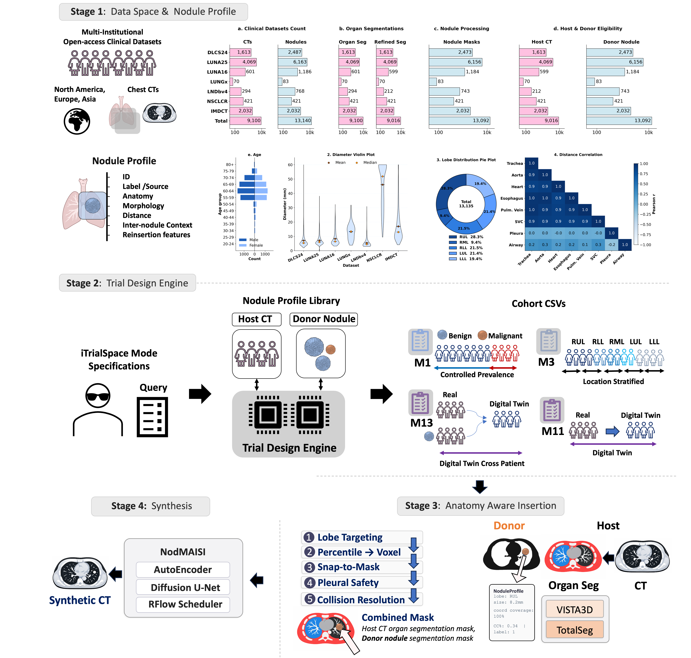
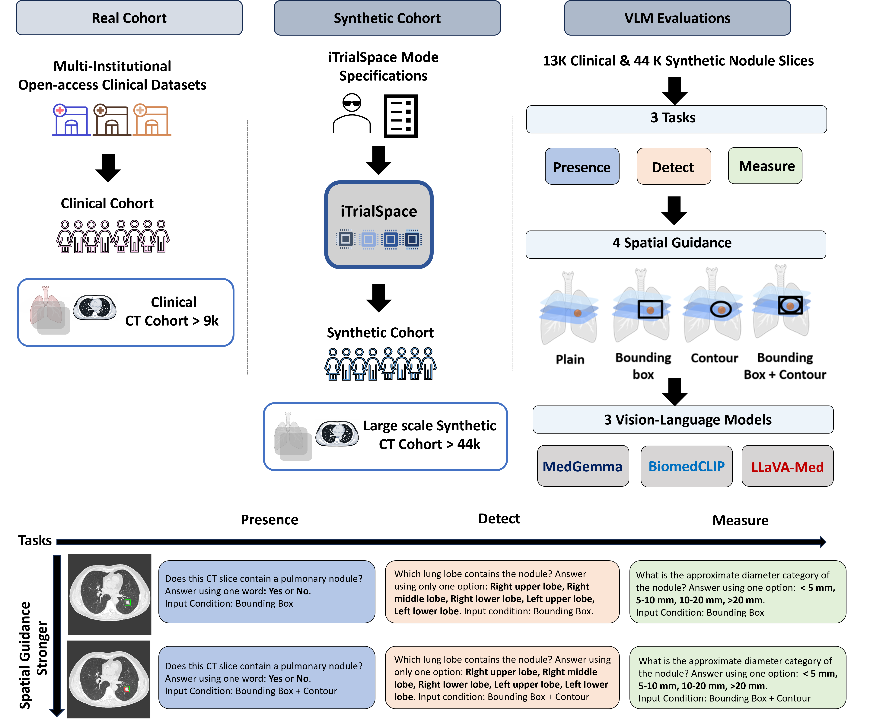

<!-- markdownlint-disable MD033 MD041 -->
<div align="center">


# iTrialSpace

**Programmable Virtual Lesion Trials for Controlled Evaluation of Lung CT Models**

*Specify the cohort you need — then manufacture anatomically grounded synthetic CTs to match,
and evaluate CADe / CADx / vision-language models under controlled, one-variable-at-a-time conditions.*

📄 **Paper:** [arXiv:2605.05761](https://arxiv.org/abs/2605.05761) ·
🤗 **Dataset:** [datasets/TusharLab/iTrialSpace_Lung](https://huggingface.co/datasets/TusharLab/iTrialSpace_Lung) ·
🧠 **Synthesis:** [NodMAISI (arXiv:2512.18038)](https://arxiv.org/abs/2512.18038) ·
⚖️ **License:** [PolyForm Noncommercial 1.0.0](https://polyformproject.org/licenses/noncommercial/1.0.0/)

</div>

> **License & use.** iTrialSpace's own code is released under the **PolyForm Noncommercial License
> 1.0.0** — free for **noncommercial** use, including academic research and teaching; **commercial use
> requires a separate license**. Some files under `src/itrialspace/synthesis/scripts/` are
> MONAI / diffusers-derived and remain **Apache-2.0**. Model weights and source CT datasets carry their
> own (often noncommercial) terms and are **not redistributed** here.
> **Research use only — not a medical device, not for clinical use.**

---

## Table of contents

1. [What it is](#1-what-it-is)
2. [Highlights](#2-highlights)
3. [The released dataset (Hugging Face)](#3-the-released-dataset-hugging-face)
4. [Architecture](#4-architecture)
5. [Installation](#5-installation)
6. [Configuration](#6-configuration)
7. [Quickstart](#7-quickstart)
8. [Run the pipeline (single machine, Docker / bash)](#8-run-the-pipeline-single-machine-docker--bash)
9. [Trial modes](#9-trial-modes)
10. [VLM evaluation](#10-vlm-evaluation)
11. [Results](#11-results)
12. [Data layout & the 7 datasets](#12-data-layout--the-7-datasets)
13. [Apps: NoduleMap & Retriever](#13-apps-nodulemap--retriever)
14. [Reproducibility](#14-reproducibility)
15. [Project layout](#15-project-layout)
16. [Command reference](#16-command-reference)
17. [Citation, license, acknowledgments](#17-citation-license-acknowledgments)

---

## 1. What it is

iTrialSpace turns medical-imaging AI evaluation from *"find more data"* into *"specify the data you
need."* It harmonizes **13,140 nodule profiles** from **7 public lung-CT datasets**, plans virtual
clinical-trial cohorts across **13 trial modes**, inserts donor nodule masks into real host anatomy,
synthesizes CT volumes with a ControlNet-conditioned diffusion model (**NodMAISI**), and evaluates
**vision-language models (VLMs)** under systematically controlled conditions.

**Why it exists.** Public lung-screening datasets are each narrow in their own way — some are enriched
for heavy smokers, some lack malignancy labels, some contain only large cancers — so AI models end up
tested on data that under-represents where they fail. iTrialSpace lets you declare a cohort by its
*statistical properties* (prevalence, size distribution, lobe distribution, demographics) and generates
synthetic CTs to match, enabling controlled experiments that fixed retrospective datasets cannot
support.

**What this repository is.** A clean, installable, **code-only** monorepo. Source CT images and trained
model weights are not redistributed here (they carry their own licenses and are large); the derived
synthetic data is released separately as a dataset on Hugging Face (see
[§3](#3-the-released-dataset-hugging-face)).

---

## 2. Highlights

**What we release publicly** ([🤗 dataset](https://huggingface.co/datasets/TusharLab/iTrialSpace_Lung)):


- ** 🫁 Open 3-D synthetic lung-CT corpus.** **44,174 synthetic CT volumes (~3 TB)** across 13 trial
  modes, shipped with the combined organ + nodule masks (nodule = **label 23**) and the cohort
  manifests that produced them — every volume is fully reproducible from a seed.
  - **🖼️ Ready-to-use VLM benchmark of synthetic CT slices.** **42,858 synthetic** evaluation cases,
  each rendered as 2-D slices under four spatial-guidance conditions (`plain`, `bbox`, `contour`,
  `bbox_contour`) with ground truth, per-model results, and **frozen, checksummed splits**. *(The
  **13,087 real-CT** cases are **not** redistributed — their slices contain real CT pixels — but we ship
  the **splits + scripts** to reproduce them from your own `raw_ct/`.)*
- **🧬 Nodule profiles + masks.** **13,140 nodule profiles** from **7 public lung-CT datasets**
  in one 53-column schema, with per-nodule and organ/body segmentation masks.
- **🔬 Real-CT evaluation tooling.** Scripts to **build and run the VLM benchmark on real CT** — not just
  synthetic — so you can directly compare model behavior on synthetic vs. real anatomy with one
  toolchain (`build_dataset.sh` with `VLM_SET=real` → `run_vlm.sh` → `analyze.sh`; SLURM equivalents too).

**Engine capabilities:**

- **Cohort-by-specification.** Declare a trial by prevalence, size, lobe, and demographics —
  calibrated to published screening trials (**NLST, NELSON**) — instead of inheriting whatever a
  retrospective dataset happens to contain.
- **Anatomy-grounded synthesis.** Donor nodule masks are placed into real host lung anatomy and
  rendered by **NodMAISI**, a ControlNet-conditioned rectified-flow model
  ([arXiv:2512.18038](https://arxiv.org/abs/2512.18038)).
- **13 trial modes** — prevalence control, size/location sensitivity, cross-dataset transfer,
  bootstrap CIs, multi-round screening, multi-nodule context, and patient digital twins.
- **Zero-shot VLM evaluation** — BiomedCLIP, LLaVA-Med, MedGemma × 3 clinical tasks × 4 guidance
  conditions, on synthetic and real CT.
- **Two interchangeable run paths** — single-machine Docker/bash and HPC SLURM — same logic, same
  `.env`, identical outputs.

**The flagship demonstration — a *Virtual Lesion Study*:**

We stress-test iTrialSpace in a **Virtual Lesion Study (VLS)**: **3 medical VLMs ×
3 clinical tasks × 4 spatial-guidance conditions** across **13 controlled trial modes and 7 real
datasets** — drawn from **50K+ CT volumes** and totaling **~2 million inference calls**. What it
surfaces:

- **Conclusions transfer to real data.** Synthetic and real accuracies correlate at **Spearman
  ρ = 0.93 (p < 10⁻¹⁵)** across all 36 model × task × condition cells.
- **The synthetic substrate is in-distribution.** All 13 modes fall within the real-to-real FID band
  (median 1.57, IQR [1.05, 2.72]); per-case host↔synthetic histogram intersection stays **> 0.80**.
- **Controlled cohorts expose shortcuts fixed benchmarks can't.** Size accuracy collapses to near
  chance once the size distribution is equalized (M2), and BiomedCLIP's size accuracy drops to
  **0.6%** once the lobe–size correlation is removed (M3).
- **Host anatomy can outweigh the lesion.** Twin-cross transplants (M13) yield host-to-donor variance
  ratios of **8.9×** (BiomedCLIP) and **3.3×** (MedGemma).


---

## 3. The released dataset (Hugging Face)

🤗 **https://huggingface.co/datasets/TusharLab/iTrialSpace_Lung**

The engine ships **code only**; the *derived data* is released as a dataset. It contains:

| Component | What it is | Scale |
|-----------|-----------|-------|
| `profiles/` | per-dataset nodule profile CSVs (coords, diameter, lobe/zone, label, 12 reinsertion features) | **13,140** nodules, 7 datasets |
| `meta/` | per-dataset metadata (demographics, acquisition, label source) | derived |
| `masks/` | segmentation masks — `nodule_seg/` (per-nodule), `refined_seg/` (organ+body) | derived NIfTI |
| `manifests/` | cohort manifests for the 13 trial modes (donor → host, location, scale) | synthetic specs |
| `inserted_masks/` | combined organ+nodule masks (nodule = **label 23**) + `audit.json` | synthesis input |
| `generated_cts/` | **3-D synthetic CT volumes** (the headline data) | **44,174** volumes (~3 TB) |
| `vlm_dataset/synthetic/` | **synthetic** 2-D VLM eval set: slices (4 conditions × 3 z), ground truth, per-model results, frozen splits | **42,858** cases — **shipped** |
| `vlm_dataset/splits/` | frozen, checksummed evaluation splits (synthetic **and** real) | reported case lists |

> **What is *not* shipped (you reproduce it):** the **real-CT VLM evaluation set** (**13,087** cases) and
> any QC montages are **not redistributed** — their slices are renderings of **real CT pixels**, which the
> source datasets' licenses don't permit us to share. The release ships the **splits** (case lists) and
> the **scripts** to rebuild the real slices from your own `raw_ct/` in one command
> (`VLM_SET=real bash infra/bash/vlm_eval/build_dataset.sh`; see [§10.1](#101-build-the-2-d-eval-dataset--cpu)).
> Only the **synthetic** CTs and slices — which contain no real CT pixels — are redistributed.

**iTrialSpace runs on masks + profiles; raw CT is optional.** The engine operates entirely in
mask / anatomy-label space and never reads source CT pixels to index, plan trials, insert masks, or
synthesize CT. The real CT **images are optional** — needed only to *reproduce* the real-CT evaluation
set and for host-comparison QC. If you need them, pull each dataset from its source under its **own
license** (see [§12](#12-data-layout--the-7-datasets)) and place the volumes under `raw_ct/{DATASET}/`.

```bash
# pull the dataset (large — use selective paths or the HF CLI):
pip install -U "huggingface_hub[cli]"
hf download TusharLab/iTrialSpace_Lung --repo-type dataset --local-dir ./iTrialSpace
# then point the code at it:  export ITRIALSPACE_DATA_DIR=$(pwd)/iTrialSpace
```

> **NodMAISI model weights** (for synthesis, [§8.3](#83-synthesis-nodmaisi-ct--gpu)) can be pulled from:
> **https://huggingface.co/TusharLab/iTrialSpace/tree/main/itrialspace/model_weights/nodmaisi_synth**
> Point `NODMAISI_MODELS_DIR` (in `.env`) at the downloaded weights directory.

> **Research use only — not for clinical use.** The synthetic CTs are generated for method development
> and evaluation; they are not medical devices and must not be used for diagnosis.

---

## 4. Architecture

```
 itrialspace        →   trials          →   mask_inserter    →   synthesis        →   evaluation
 (nodule index +        (cohort             (donor mask          (NodMAISI            (VLM
  query + features)      manifests)          → host anatomy)      CT volumes)          zero-shot)
      │
      ├─ nodulemap   — interactive embedding-graph explorer
      └─ retriever   — faceted search, similarity & donor matching + CT viewer
```

One installable package, `itrialspace`, with sub-packages per stage:

1. **Index** — harmonize 7 datasets into one nodule index with reinsertion features.
2. **Trials** — plan cohort **manifests** for the 13 trial modes (donor → host, location, scale).
3. **Mask insertion** — paste donor nodule masks into host organ/lobe masks (nodule = **label 23**).
4. **Synthesis** — render CT volumes from the combined masks with **NodMAISI**.
5. **Evaluation** — score **VLMs** zero-shot under controlled conditions.

Configuration, I/O, and path resolution are centralized so nothing hardcodes a machine-specific path.

<div align="center">

</div>

---

## 5. Installation

Two routes — **conda** for a host install, or **Docker** for a self-contained GPU image that runs every
stage.

### A) conda (host install)

```bash
conda env create -f environment.yml && conda activate itrialspace
pip install -e ".[all]"          # or a subset — see the extras matrix
```

**Extras matrix**

| Extra | Installs | For |
|-------|----------|-----|
| *(base)* | pandas, numpy, pyyaml | Index, query, trial planning |
| `imaging` | nibabel, scipy, SimpleITK | Mask insertion, NIfTI handling |
| `web` | fastapi, streamlit, faiss, umap | NoduleMap + Retriever UIs |
| `synthesis` | monai, (torch) | NodMAISI CT synthesis ¹ |
| `vlm` | transformers, accelerate, open_clip | VLM evaluation ¹ |
| `dev` | pytest, ruff, black, pre-commit | Development |
| `all` | imaging + web + vlm + dev | Everything bundled |

¹ PyTorch is platform-specific — install the build matching your CUDA, or use the Docker GPU image
(which bundles it).

### B) Docker — GPU image (recommended for synthesis + VLM)

Bundles torch + CUDA/cuDNN and `[imaging,synthesis,vlm,apps]`, so it runs the whole pipeline. Needs the
NVIDIA Container Toolkit (`--gpus all`).

```bash
docker build -t itrialspace:gpu -f docker/Dockerfile.gpu .

# the wrapper sets --gpus / --user / --shm-size / HF cache / mounts, and reads paths + HF_TOKEN from .env:
ITS_DATA=/host/iTrialSpace infra/bash/docker_run.sh config
ITS_DATA=/host/iTrialSpace ENTRY=bash infra/bash/docker_run.sh -lc 'bash infra/bash/run_pipeline.sh 1 trials'
```

The image is **code-only and world-readable**, so it runs under any host user (`--user $(id -u)`) and is
safe to share — package it with `infra/bash/docker_save.sh` (→ tarball) or push to a registry. Notable
build details (handled for you):

- **Runs as your host uid** (`--user`, `HOME=/tmp`) so data on group-restricted shares and weights under
  your home dir are readable.
- **`--shm-size 16g`** — PyTorch DataLoaders need more than Docker's 64 MB default.
- **VLM stack pinned** (`transformers==4.51.3`, `open_clip_torch==2.32.0`, …) — the unpinned latest
  `transformers` breaks on the bundled torch.
- **HF model cache** persisted to `$ITRIALSPACE_OUTPUT_DIR/.hf_cache` so models download once.

---

## 6. Configuration

Everything is driven by environment variables (loaded from a gitignored `.env`); nothing is hardcoded.

```bash
cp .env.example .env        # then edit:
#   ITRIALSPACE_DATA_DIR     → the dataset root (raw_ct/ masks/ profiles/ …)
#   ITRIALSPACE_OUTPUT_DIR   → where generated artifacts go (default: = data dir)
#   NODMAISI_MODELS_DIR      → NodMAISI weights dir (synthesis only)
#   HF_TOKEN                 → HuggingFace token for gated VLMs (MedGemma); kept local, never committed
```

Any config YAML may reference these with `${VAR}` interpolation. `its config` prints the resolved paths.

---

## 7. Quickstart

```bash
conda activate itrialspace          # or use the Docker wrapper (see §5B)
pip install -e ".[all]"
cp .env.example .env                 # set ITRIALSPACE_DATA_DIR (+ HF_TOKEN for gated VLMs)

pytest -m "not full_volume"          # unit tests — no external data needed
its config                           # verify resolved paths
its index stats                      # build the nodule index + print stats (needs profiles/)
```

---

## 8. Run the pipeline — single machine (Docker / bash) **or** HPC (SLURM)

The core pipeline is **trials → insert → synth**, per trial mode. iTrialSpace ships **two
interchangeable drivers with the same CLI** — both read the same `.env` and the same per-mode logic, and
produce **identical outputs**; only the launcher differs:

- **Single machine (Docker / bash):** `infra/bash/run_pipeline.sh <mode> [stage]` — runs in the
  foreground; parallelism via env knobs (`JOBS`, `PER_GPU`).
- **HPC (SLURM):** `infra/slurm/run_pipeline.sh <mode> [stage]` — submits `sbatch` **array jobs** with
  dependencies; parallelism via the scheduler.

> **Conventions for the examples below.** Single-machine commands run *inside* the GPU image — prefix
> with `ENTRY=bash infra/bash/docker_run.sh -lc '…'` (omitted below for brevity), or run them directly on
> a conda host. SLURM commands are submitted from the repo root. `[stage]` = `all` (default) `| trials |
> insert | synth`.

| Task | Single machine (Docker / bash) | HPC (SLURM) |
|------|--------------------------------|-------------|
| One mode, full pipeline | `bash infra/bash/run_pipeline.sh 1 all` | `infra/slurm/run_pipeline.sh 1` |
| One stage only | `bash infra/bash/run_pipeline.sh 1 trials` | `infra/slurm/run_pipeline.sh 1 trials` |
| All 13 modes | `for m in $(seq 1 13); do bash infra/bash/run_pipeline.sh $m all; done` | `for m in $(seq 1 13); do infra/slurm/run_pipeline.sh $m; done` |

Outputs → `$ITRIALSPACE_OUTPUT_DIR/{manifests,inserted_masks,generated_cts}/mode<N>/…`. Single-machine
runs log to `$ITRIALSPACE_OUTPUT_DIR/logs/…`; SLURM logs to `logs/%j.out`.

### 8.1 Trials (cohort manifests) — CPU

Builds `manifests/mode<N>_*/*.csv` from the nodule index. CPU; fast.

**Single machine (Docker / bash):**
```bash
# one mode
ENTRY=bash infra/bash/docker_run.sh -lc 'bash infra/bash/run_pipeline.sh 1 trials'

# all 13 modes (sequential)
ENTRY=bash infra/bash/docker_run.sh -lc 'for m in $(seq 1 13); do bash infra/bash/run_pipeline.sh $m trials; done'

# several modes at once (JOBS = how many run concurrently)
ENTRY=bash infra/bash/docker_run.sh -lc 'JOBS=4 bash infra/bash/run_sweep.sh trials 1 2 3 4 5 6'

# paper-size for a specific mode (see §8.4 for the per-mode knob)
ENTRY=bash infra/bash/docker_run.sh -lc 'N_CASES=1000 bash infra/bash/run_pipeline.sh 1 trials'
```
**HPC (SLURM):**
```bash
# one mode — via the orchestrator (recommended) or the .sub directly
infra/slurm/run_pipeline.sh 1 trials
sbatch infra/slurm/trials/mode1_controlled_prevalence.sub

# all 13 modes / selected modes
infra/slurm/trials/submit_all.sh
infra/slurm/trials/submit_all.sh 1 3 8

# paper size: edit the N_CASES (etc.) line in the mode's .sub, then submit
```

### 8.2 Insertion (label-23 masks + audit) — CPU

Reads each manifest, pastes the donor nodule (label 23) into host anatomy →
`inserted_masks/mode<N>_*/<manifest>/{*_mask.nii.gz, audit.json}`. CPU. Two parallelism dials on the
single-machine path: `N_JOBS` (case-workers within one manifest, default 8) and `JOBS` (manifests of a
mode run at once). On SLURM the `sbatch --array` fans out one task per manifest.

**Single machine (Docker / bash):**
```bash
# one mode
ENTRY=bash infra/bash/docker_run.sh -lc 'bash infra/bash/run_pipeline.sh 1 insert'

# one mode, manifests in parallel (e.g. all 6 manifests of mode 2 at once × 8 workers each)
ENTRY=bash infra/bash/docker_run.sh -lc 'JOBS=6 bash infra/bash/mask_inserter/insert_masks.sh 2'

# all 13 modes (sequential)
ENTRY=bash infra/bash/docker_run.sh -lc 'for m in $(seq 1 13); do bash infra/bash/run_pipeline.sh $m insert; done'

# all 13 modes, 4 modes at a time
ENTRY=bash infra/bash/docker_run.sh -lc 'JOBS=4 bash infra/bash/run_sweep.sh insert'
```
**HPC (SLURM):**
```bash
# one mode (orchestrator submits the insertion array)
infra/slurm/run_pipeline.sh 1 insert

# directly: an array job with one task per manifest in the mode
sbatch --array=0-$(($(ls $ITRIALSPACE_OUTPUT_DIR/manifests/mode1_*/*.csv | wc -l) - 1)) \
       infra/slurm/mask_inserter/mode1_insert_masks_array.sub

# all modes
for m in $(seq 1 13); do infra/slurm/run_pipeline.sh $m insert; done
```

### 8.3 Synthesis (NodMAISI CT) — GPU

Reads the insertion audits, generates a synthetic CT per case →
`generated_cts/mode<N>/<manifest>/<case>/synthetic_ct.nii.gz`. **GPU; ~20 GB per case.** Single-machine
spreads a mode's cases across **all visible GPUs** (`GPUS`, `PER_GPU`); SLURM runs **one array task per
case**, one GPU each.

**Single machine (Docker / bash):**
```bash
# one mode — cases auto-dispatched across all GPUs
ENTRY=bash infra/bash/docker_run.sh -lc 'bash infra/bash/run_pipeline.sh 1 synth'

# one mode, pack 4 cases per GPU (4 GPUs × 4 = 16 in flight); pick GPUs with GPUS="..."
ENTRY=bash infra/bash/docker_run.sh -lc 'PER_GPU=4 GPUS="0 1 2 3" bash infra/bash/run_pipeline.sh 1 synth'

# all 13 modes
ENTRY=bash infra/bash/docker_run.sh -lc 'for m in $(seq 1 13); do PER_GPU=4 bash infra/bash/run_pipeline.sh $m synth; done'

# alternative: run several modes at once, one GPU each (good for many small modes)
ENTRY=bash infra/bash/docker_run.sh -lc 'bash infra/bash/run_sweep.sh synth'
```
**HPC (SLURM):**
```bash
# one mode (orchestrator builds the case list and submits one array task per case)
infra/slurm/run_pipeline.sh 1 synth

# all modes
for m in $(seq 1 13); do infra/slurm/run_pipeline.sh $m synth; done

# whole pipeline chained with dependencies (trials → insert → synth), one mode:
infra/slurm/run_pipeline.sh 1
```

### 8.4 Run size: demo → paper

The trials scripts ship a small **demo** (≈5 cases/mode) so a full sweep finishes in seconds. Switch to
paper sizes per mode with env vars (insert/synth scale automatically to whatever trials produced):

| Mode | Knob(s) | Demo | Paper |
|------|---------|------|-------|
| 1 controlled_prevalence | `N_CASES` | 5 | 1000 |
| 2 size_detection_curve | `N_PER_BUCKET` | 5 | 100 |
| 3 location_sensitivity | `N_PER_LOBE` | 5 | 100 |
| 4 demographic_strat | `N_PER_STRATUM` | 5 | 200 |
| 5 counterfactual | `N_CASES` | 5 | 500 |
| 6 cross_dataset | `N_CASES` | 5 | 300 |
| 7 bootstrap_confidence | `N_CASES` / `N_BOOTSTRAP` | 5 / 3 | 200 / 20 |
| 8 algorithm_comparison | `N_CASES` | 5 | 500 |
| 9 screening_simulation | `N_CASES_PER_ROUND` | 5 | 500 |
| 10 multi_nodule_realism | `N_CASES` | 5 | 500 |
| 11 digital_twin_isolation | `DATASETS` / `MAX_PATIENTS` | DLCS24 / 5 | all 7 / `all` |
| 12 digital_twin_complete | `DATASETS` / `MAX_PATIENTS` | DLCS24 / 5 | all 7 / `all` |
| 13 digital_twin_cross | `HOST_DATASETS` / `DONOR_DATASETS` / `MAX_DONOR_NODULES` | DLCS24 / LUNA25 / 5 | all 7 / all 7 / 250 |

```bash
ENTRY=bash infra/bash/docker_run.sh -lc 'N_CASES=1000 bash infra/bash/run_pipeline.sh 1 trials'   # paper-size mode 1
```

---

## 9. Trial modes

Thirteen cohort designs; `<mode>` is `1`–`13` for `run_pipeline.sh`, or the `--mode` name for `its-trials`.

| # | `--mode` | Question it answers |
|---|----------|---------------------|
| 1 | `controlled_prevalence` | How does performance change with cancer **prevalence**? |
| 2 | `size_detection_curve` | Detection sensitivity vs. nodule **size** (FROC) |
| 3 | `location_sensitivity` | Detection vs. anatomical **lobe** |
| 4 | `demographic_strat` | Performance across **demographic** strata |
| 5 | `counterfactual` | The same cohort swept over one parameter (e.g. prevalence) |
| 6 | `cross_dataset` | Generalization across acquisition **sources** |
| 7 | `bootstrap_confidence` | **Confidence intervals** via resampled cohorts |
| 8 | `algorithm_comparison` | Standardized head-to-head model comparison |
| 9 | `screening_simulation` | Multi-round screening with **prevalence decay** |
| 10 | `multi_nodule` | Impact of **companion** nodules in context |
| 11 | `digital_twin_isolation` | Each native nodule **isolated** within its host anatomy |
| 12 | `digital_twin_complete` | **All** native nodules of a scan, reconstructed |
| 13 | `digital_twin_cross` | Donor nodules placed in **cross-patient** host anatomy |

Modes 11–13 (digital twins) match at the **CT-scan level** (`host_ct_path == donor_ct_path`), enabling
task-level fidelity comparison of AI on real vs. synthetic versions of the same anatomy.

---

## 10. VLM evaluation

Evaluate **BiomedCLIP**, **LLaVA-Med**, and **MedGemma** on three zero-shot tasks —
**presence** (binary), **lobe** (5-class), **size** (4-class) — under four image **conditions**
(`plain`, `bbox`, `contour`, `bbox_contour`), on synthetic and real CT. Three steps — **build → run →
analyze** — each available on a single machine (`infra/bash/vlm_eval/*.sh`, inside the GPU image) or on
SLURM (`sbatch infra/slurm/vlm_eval/*.sub`); both honour the same env knobs (`VLM_SET`, `PROFILE`,
`VLM_MODES`, `EVAL_DIR`, `MODEL`, `GPU`, `RESULTS`, `SPLIT`, `NBOOT`). BiomedCLIP/LLaVA-Med use the
`lung_axial` profile; MedGemma uses `lung_axial_medgemma` (a different HU-window RGB encoding).

<div align="center">

</div>


### 10.1 Build the 2-D eval dataset — CPU

**Single machine (Docker / bash):**
```bash
# synthetic, lung_axial profile (BiomedCLIP/LLaVA-Med), all 13 modes:
ENTRY=bash infra/bash/docker_run.sh -lc 'VLM_MODES="1 2 3 4 5 6 7 8 9 10 11 12 13" bash infra/bash/vlm_eval/build_dataset.sh'
# synthetic, MedGemma profile:
ENTRY=bash infra/bash/docker_run.sh -lc 'PROFILE=lung_axial_medgemma VLM_MODES="1 2 3 4 5 6 7 8 9 10 11 12 13" bash infra/bash/vlm_eval/build_dataset.sh'
# real CT (demo = DLCS24+LUNA25; VLM_MAX="" for the full set); add PROFILE=lung_axial_medgemma for MedGemma:
ENTRY=bash infra/bash/docker_run.sh -lc 'VLM_SET=real bash infra/bash/vlm_eval/build_dataset.sh'
ENTRY=bash infra/bash/docker_run.sh -lc 'VLM_SET=real PROFILE=lung_axial_medgemma bash infra/bash/vlm_eval/build_dataset.sh'
```
**HPC (SLURM):** (`sbatch` exports your shell env by default, so the same knobs work)
```bash
VLM_MODES="1 2 3 4 5 6 7 8 9 10 11 12 13" sbatch infra/slurm/vlm_eval/build_dataset.sub
PROFILE=lung_axial_medgemma VLM_MODES="1 2 3 4 5 6 7 8 9 10 11 12 13" sbatch infra/slurm/vlm_eval/build_dataset.sub
VLM_SET=real sbatch infra/slurm/vlm_eval/build_dataset.sub
VLM_SET=real PROFILE=lung_axial_medgemma sbatch infra/slurm/vlm_eval/build_dataset.sub
```

### 10.2 Run a model across all conditions × tasks — GPU

**Single machine (Docker / bash):** `GPU=N` pins a card, so the three models can run at once (append
`&` … `& wait`). On the **real** set, point `EVAL_DIR` at it.
```bash
# synthetic:
ENTRY=bash infra/bash/docker_run.sh -lc 'MODEL=biomedclip GPU=0 bash infra/bash/vlm_eval/run_vlm.sh'
ENTRY=bash infra/bash/docker_run.sh -lc 'MODEL=llava_med  GPU=1 bash infra/bash/vlm_eval/run_vlm.sh'
ENTRY=bash infra/bash/docker_run.sh -lc 'MODEL=medgemma   GPU=2 bash infra/bash/vlm_eval/run_vlm.sh'   # gated → needs HF_TOKEN
# real:
ENTRY=bash infra/bash/docker_run.sh -lc 'MODEL=biomedclip GPU=0 EVAL_DIR=$ITRIALSPACE_OUTPUT_DIR/vlm_eval_demo_real/lung_axial          bash infra/bash/vlm_eval/run_vlm.sh'
ENTRY=bash infra/bash/docker_run.sh -lc 'MODEL=medgemma   GPU=2 EVAL_DIR=$ITRIALSPACE_OUTPUT_DIR/vlm_eval_demo_real/lung_axial_medgemma bash infra/bash/vlm_eval/run_vlm.sh'
```
**HPC (SLURM):** (the scheduler places each model job on its own GPU)
```bash
MODEL=biomedclip sbatch infra/slurm/vlm_eval/run_vlm.sub
MODEL=llava_med  sbatch infra/slurm/vlm_eval/run_vlm.sub
MODEL=medgemma   sbatch infra/slurm/vlm_eval/run_vlm.sub
# real set:
MODEL=biomedclip EVAL_DIR=$ITRIALSPACE_OUTPUT_DIR/vlm_eval_demo_real/lung_axial sbatch infra/slurm/vlm_eval/run_vlm.sub
```

### 10.3 Analyze → tables, figures, report.md — CPU

Auto-discovers whatever models/conditions/tasks are present and writes one comparison report.

**Single machine (Docker / bash):**
```bash
ENTRY=bash infra/bash/docker_run.sh -lc 'bash infra/bash/vlm_eval/analyze.sh'                                                       # synthetic
ENTRY=bash infra/bash/docker_run.sh -lc 'RESULTS=$ITRIALSPACE_OUTPUT_DIR/vlm_eval_demo_real bash infra/bash/vlm_eval/analyze.sh'    # real
```
**HPC (SLURM):**
```bash
sbatch infra/slurm/vlm_eval/analyze.sub
RESULTS=$ITRIALSPACE_OUTPUT_DIR/vlm_eval_demo_real sbatch infra/slurm/vlm_eval/analyze.sub
```

Ground truth: `presence` is binary; `lobe` uses the 5 canonical classes (`RUL/RML/RLL/LUL/LLL`); `size`
uses half-open diameter bins (`<5`, `[5,10)`, `[10,20)`, `≥20` mm). Accuracy = mean(`prediction ==
ground_truth`), reported per condition so the effect of spatial guidance is measurable. The analysis
engine auto-discovers whatever models/conditions/tasks are present and writes one comparison `report.md`.

---

## 11. Results

Zero-shot accuracy (%) on the frozen `release_v1_full` split (only cases scored by all 3 models × 4
conditions × 3 tasks, so columns are directly comparable). Chance: presence 50% · lobe 20% · size 25%.
The **real** numbers are reproduced from your own `raw_ct/` (the real slices are not redistributed); the
**splits** that pin these exact cases are shipped, so the numbers are verifiable.

### Synthetic (N = 41,502)

| Model | Task | plain | bbox | contour | bbox_contour | best |
|-------|------|------:|-----:|--------:|-------------:|------|
| BiomedCLIP | presence | 17.6 | 46.6 | 63.0 | 30.1 | contour |
| BiomedCLIP | lobe | 38.5 | 58.4 | 67.4 | 66.6 | contour |
| BiomedCLIP | size | 28.8 | 29.0 | 28.7 | 30.6 | bbox_contour |
| LLaVA-Med | presence | 100.0 | 100.0 | 100.0 | 100.0 | bbox |
| LLaVA-Med | lobe | 20.4 | 8.7 | 6.0 | 6.9 | plain |
| LLaVA-Med | size | 28.2 | 28.2 | 28.2 | 28.2 | plain |
| MedGemma | presence | 18.4 | 88.0 | 88.3 | 87.5 | contour |
| MedGemma | lobe | 47.8 | 62.7 | 55.6 | 55.3 | bbox |
| MedGemma | size | 41.5 | 45.1 | 42.7 | 46.0 | bbox_contour |

### Real (N = 13,047)

| Model | Task | plain | bbox | contour | bbox_contour | best |
|-------|------|------:|-----:|--------:|-------------:|------|
| BiomedCLIP | presence | 13.0 | 35.1 | 44.0 | 27.6 | contour |
| BiomedCLIP | lobe | 52.3 | 74.8 | 78.5 | 77.1 | contour |
| BiomedCLIP | size | 25.8 | 26.3 | 25.5 | 27.2 | bbox_contour |
| LLaVA-Med | presence | 100.0 | 100.0 | 100.0 | 100.0 | bbox |
| LLaVA-Med | lobe | 22.1 | 11.2 | 7.8 | 7.9 | plain |
| LLaVA-Med | size | 24.9 | 24.9 | 24.9 | 24.9 | plain |
| MedGemma | presence | 22.2 | 92.1 | 91.7 | 93.1 | bbox_contour |
| MedGemma | lobe | 44.5 | 53.0 | 47.2 | 46.9 | bbox |
| MedGemma | size | 43.0 | 49.6 | 47.5 | 50.1 | bbox_contour |

**Takeaways.** Spatial guidance (bbox / contour) dramatically improves localization-dependent tasks —
e.g. MedGemma presence jumps from ~18–22% to ~88–93%, and BiomedCLIP lobe improves ~20–25 points.
LLaVA-Med degenerates to always-"present" (100% presence is not skill) and its lobe accuracy *drops* with
guidance. Crucially, **the same trends hold on synthetic and real CT**, supporting iTrialSpace's premise
that controlled synthetic cohorts probe model behavior the way real data does.

---

## 12. Data layout & the 7 datasets

Point `ITRIALSPACE_DATA_DIR` at a directory with this structure:

```
$ITRIALSPACE_DATA_DIR/
├── raw_ct/{DATASET}/            CT scans (NIfTI, RAS+)         ← optional; you provide it
├── masks/{DATASET}/
│   ├── nodule_seg/              individual nodule masks
│   └── refined_seg/             refined organ + body segs (default)
├── profiles/                    {DATASET}_nodule_profiles.csv  (53-column schema)
├── meta/                        original dataset metadata CSVs
├── manifests/                   generated cohort manifests
├── inserted_masks/              mask-insertion outputs (nodule = label 23) + audit.json
└── generated_cts/               NodMAISI synthesis outputs
```

`ct_path` values in the profile CSVs are **relative** to `raw_ct/` (e.g. `DLCS24/DLCS_0001.nii.gz`).

### The 7 datasets

| Dataset | Profiles | Source | Notes |
|---------|---------:|--------|-------|
| **LUNA25** | 6,163 | LUNA25 challenge | Largest; multi-nodule screening |
| **DLCS24** | 2,487 | Duke Lung Cancer Screening | Binary label, Lung-RADS, demographics |
| **IMDCT** | 2,032 | Internal multi-modal diagnostic CT | PET, spiculation, benign/cancer |
| **LUNA16** | 1,186 | LUNA16 / LIDC-IDRI — luna16.grand-challenge.org | No malignancy label (anatomy only) |
| **LNDbv4** | 768 | LNDb (v4) — lndb.grand-challenge.org | Multi-radiologist ratings |
| **NSCLCR** | 421 | NSCLC-Radiomics (TCIA) | 100% malignant; staging/survival |
| **LUNGx** | 83 | SPIE-AAPM-NCI LUNGx (TCIA) | Malignancy benchmark, ~49% malignant |
| **Total** | **13,140** | | |

> ⚠️ Each source CT dataset carries its **own license and citation requirements** and is **not
> redistributed** by iTrialSpace. Obtain `raw_ct/` from each provider, honour its terms, and cite it
> (alongside iTrialSpace). The release ships only derived profiles, masks, manifests, inserted masks,
> **synthetic** CTs, and the **synthetic** VLM eval set + the splits — **never real CT pixels** (so the
> real-CT VLM slices are reproduced from your `raw_ct/`, not shipped).

---

## 13. Apps: NoduleMap & Retriever

Two interactive apps over the nodule space, each with dedicated single-machine scripts
(`infra/bash/{nodulemap,retriever}/`) and SLURM equivalents (`infra/slurm/{nodulemap,retriever}/`).
In Docker, publish the ports with `ITS_PORTS="…"` and open `http://localhost:<port>`.

- **NoduleMap** — an interactive embedding-graph explorer of the nodule space (build artifacts, then serve).
- **Retriever** — faceted search, similarity & donor matching, with an integrated CT viewer (FastAPI API + Streamlit UI), plus a CLI.

### NoduleMap

**Single machine (Docker / bash):**
```bash
# 1) build artifacts (embeddings + KNN edges) → $ITRIALSPACE_OUTPUT_DIR/nodulemap_artifacts
ENTRY=bash infra/bash/docker_run.sh -lc 'bash infra/bash/nodulemap/build.sh'
# 2) serve (port 8422) — open http://localhost:8422
ITS_PORTS="8422" ENTRY=bash infra/bash/docker_run.sh -lc 'bash infra/bash/nodulemap/serve.sh'
```
*Notes:* `serve.sh` loads existing artifacts directly — **skip step 1** if you already built them. The
wrapper **auto-remaps** a host `NODULEMAP_ARTIFACTS` path (e.g. under your data dir) to its container
mount, so prebuilt artifacts are found with no extra flags. `ITS_PORTS="8422"` is required for the
browser to reach it.
**HPC (SLURM):** `sbatch infra/slurm/nodulemap/rebuild_nodulemap.sub` then `sbatch infra/slurm/nodulemap/nodulemap.sub`.

### Retriever

**Single machine (Docker / bash):**
```bash
# serve API (8421) + UI (8501) — open http://localhost:8501
ITS_PORTS="8421 8501" ENTRY=bash infra/bash/docker_run.sh -lc 'bash infra/bash/retriever/serve.sh'

# or the CLI (no server): info / search / similar / match / detail / export
ENTRY=bash infra/bash/docker_run.sh -lc 'bash infra/bash/retriever/cli.sh info'
ENTRY=bash infra/bash/docker_run.sh -lc 'bash infra/bash/retriever/cli.sh search --label 1 --lobe right_lung_upper_lobe --limit 50'
```
*Notes:* publish **both** ports (`ITS_PORTS="8421 8501"`) — the UI talks to the API, so both must be
reachable. `serve.sh` starts the FastAPI API and the Streamlit UI together and stops both on Ctrl-C; it
waits for the API to be healthy before launching the UI. CLI subcommands: `info`, `search`, `similar`,
`match`, `detail`, `export`.
**HPC (SLURM):** `sbatch infra/slurm/retriever/app.sub` (API+UI) · `sbatch infra/slurm/retriever/cli.sub`.

(For local/internal exploration only — mind the data-governance note before exposing them.)

---

## 14. Reproducibility

- **Frozen splits.** Each result is reported on a checksummed case list (`vlm_dataset/splits/`):
  `release_v1` (the headline set) and `release_v1_full` (cases scored under all four conditions).
  `splits.json` records counts, SHA-256, and provenance — regenerate and the hash must match.
- **One reporting N.** Accuracy is computed on the cases scored in *every* (model × condition × task),
  keyed by a stable canonical slice id (not a positional index), so all numbers are directly comparable.
- **Determinism.** `SEED=42` throughout; every synthesis case carries an audit record.
- **Run a fixed split:** pass `--case-ids vlm_dataset/splits/release_v1.synthetic.txt` to the VLM runner.

---

## 15. Project layout

```
itrialspace/
├── src/itrialspace/             # the package
│   ├── core/ io/ index/ query/ site/   # nodule index, query, path resolution
│   ├── config/                  # env-driven settings + ${VAR} interpolation
│   ├── trials/                  # the 13 trial-mode cohort planners
│   ├── mask_inserter/           # donor mask → host anatomy (label-23 insertion)
│   ├── synthesis/               # NodMAISI CT synthesis (code; weights external)
│   │   └── scripts/             #   ⚠ MONAI/diffusers-derived — Apache-2.0
│   ├── apps/{nodulemap,retriever}/     # the two apps
│   └── evaluation/vlm_eval/     # build → run → analyze (+ eval_analysis, runners, models)
├── infra/
│   ├── slurm/                   # HPC job scripts (.sub) — sbatch orchestration
│   └── bash/                    # single-machine pipeline (Docker/bash, no SLURM):
│       ├── env.sh  run_pipeline.sh  run_sweep.sh
│       ├── trials/mode<1-13>_*.sh
│       ├── mask_inserter/insert_masks.sh
│       ├── synthesis/synthesize.sh
│       ├── vlm_eval/{build_dataset,run_vlm,analyze}.sh
│       ├── nodulemap/{build,serve}.sh   retriever/{serve,cli}.sh
│       └── docker_run.sh  docker_save.sh
├── configs/  docker/  tests/  tools/
├── LICENSE  NOTICE              # PolyForm Noncommercial (own code) + third-party terms
└── pyproject.toml  environment.yml  .env.example  CITATION.cff
```

---

## 16. Command reference

| Command | Purpose |
|---------|---------|
| `its` | Umbrella CLI — index, query, config |
| `its-trials --mode <name>` | Generate cohort manifests for the 13 trial modes |
| `its-insert run` | Insert donor nodule masks into host anatomy from a manifest |
| `its-nodulemap serve` | Launch the NoduleMap server |
| `its-retriever serve` | Launch the Retriever API + UI |
| `infra/bash/run_pipeline.sh <mode> [trials\|insert\|synth\|all]` | **Single-machine** core pipeline driver |
| `infra/slurm/run_pipeline.sh <mode> [trials\|insert\|synth\|all]` | **HPC (SLURM)** core pipeline driver (`sbatch` arrays) |
| `infra/bash/run_sweep.sh <stage> [modes…]` | Run a stage across many modes concurrently (single machine) |
| `infra/slurm/trials/submit_all.sh [modes…]` | Submit all/selected trial modes to SLURM |
| `infra/bash/vlm_eval/{build_dataset,run_vlm,analyze}.sh` | VLM build → run → analyze (single machine) |
| `sbatch infra/slurm/vlm_eval/{build_dataset,run_vlm,analyze}.sub` | VLM build → run → analyze (SLURM) |
| `infra/bash/nodulemap/{build,serve}.sh` | NoduleMap: build artifacts / serve the explorer |
| `infra/bash/retriever/{serve,cli}.sh` | Retriever: serve API+UI / command-line search |
| `infra/bash/docker_run.sh` / `docker_save.sh` | GPU-image run wrapper / share as tarball |

Python module entry points: `itrialspace.evaluation.vlm_eval.{build_dataset, build_real_dataset,
runners.run_conditions, make_split, eval_analysis}`.

---

## 17. Citation, license, acknowledgments

**Cite** iTrialSpace (and each underlying CT dataset you download into `raw_ct/`):

```bibtex
@article{tushar2026itrialspace,
  title   = {iTRIALSPACE: Programmable Virtual Lesion Trials for Controlled Evaluation of Lung CT Models},
  author  = {Tushar, Fakrul Islam and Momy, Umme Hafsa and Lo, Joseph Y and Rubin, Geoffrey D},
  journal = {arXiv preprint arXiv:2605.05761},
  year    = {2026}
}
```

**License.** iTrialSpace's own code: **PolyForm Noncommercial License 1.0.0**
(https://polyformproject.org/licenses/noncommercial/1.0.0/) — noncommercial / academic use; commercial
use by separate license. MONAI / diffusers-derived files under `src/itrialspace/synthesis/scripts/`
remain **Apache-2.0**. See `LICENSE` and `NOTICE`. Model weights (NodMAISI/MAISI, MedGemma) and the source
CT datasets carry their own (often noncommercial) terms and are **not redistributed**. Research use only;
not a medical device and not for clinical use.


## Acknowledgments

iTrialSpace is built on the work of many open research efforts, and we are grateful to their authors
and maintainers.

**Source datasets.** The seven public CT datasets, each obtained from its
original provider under its own license and citation terms: **DLCS24** (Duke Lung Cancer Screening;
Wang et al., *Radiology: AI* 2025), **LUNA25** (Peeters et al., *MICCAI* 2025), **LUNA16** / LIDC-IDRI
(Setio et al., *Med. Image Anal.* 2017; Armato et al., *Med. Phys.* 2011), **LUNGx** (SPIE-AAPM-NCI;
Armato et al., *J. Med. Imaging* 2016), **LNDb** (Pedrosa et al., *Med. Image Anal.* 2021),
**NSCLC-Radiomics** (Aerts et al., *Nat. Commun.* 2014), and **IMDCT** (Zhao et al., *Nat. Commun.*
2025). Several are distributed through **The Cancer Imaging Archive (TCIA)**. Please cite each dataset
per its provider — see [§12](#12-data-layout--the-7-datasets) and the dataset card.

**Models and tools.** CT synthesis uses **NodMAISI** ([arXiv:2512.18038](https://arxiv.org/abs/2512.18038)),
which builds on **MAISI / Project-MONAI** (Guo et al., *WACV* 2025) and **Hugging Face diffusers**
(both Apache-2.0). Anatomy segmentation uses **VISTA3D** (He et al., 2024) for organ labels and
**TotalSegmentator** (Wasserthal et al., *Radiology: AI* 2023) for lung-lobe labels; nodule masks for
unannotated cases use **PiNS** (Zenodo [10.5281/zenodo.17171571](https://doi.org/10.5281/zenodo.17171571),
CC-BY-NC-4.0). Distributional fidelity is measured with a **RadImageNet**-pretrained feature extractor.
The vision–language evaluation uses **BiomedCLIP** (Zhang et al., *NEJM AI* 2024), **LLaVA-Med** (Li et
al., *NeurIPS D&B* 2023), and **MedGemma** (Sellergren et al., 2025), each used under its respective
license.

**Funding and support.** This work was supported by startup funding from the Department of Radiology
and Imaging Sciences, University of Arizona. Initial computational support was provided by the Center
for Virtual Imaging Trials, Duke University.

Any errors are our own, and inclusion here does not imply endorsement by the cited projects or their
authors.


<div align="center">
<sub>iTrialSpace — specify the cohort, synthesize the data, evaluate with control.</sub>
</div>
